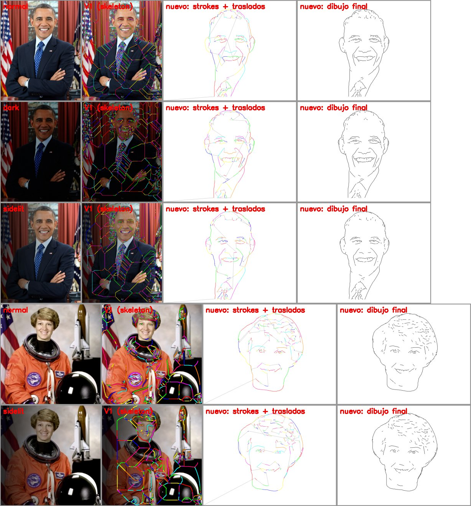

# Robot Drawing — De una foto a trayectorias para el robot (V2)

Sistema de visión por computadora que convierte una **fotografía de una
persona** (o de un dibujo de líneas) en **trayectorias 2D en milímetros**
listas para que un robot las dibuje con cinemática inversa (IK).

> **V2:** se agrega el modo `face` (retratos), que es ahora el modo por
> defecto, y una etapa final `robot_path`. Esta etapa genera strokes cortos
> con waypoints densos, en mm y ordenados, y los exporta a un CSV que se lee
> directamente desde MATLAB.



*Columnas: foto (normal / oscura / iluminación lateral); resultado de la V1;
trayectoria nueva (cada color es un stroke y las líneas grises son los
traslados con el lápiz arriba); simulación de lo que dibujará el robot.*

---

## Estructura del repositorio

```text
├── main.py                 CLI: foto -> trayectoria (modos face y drawing)
├── validate.py             validación por lotes (hoja de contacto + summary.csv)
├── config.py               todos los parámetros
├── image_processing/
│   ├── face.py             cara, recorte, fondo, iluminación, líneas XDoG
│   ├── skeleton.py         skeleton -> strokes en px
│   ├── robot_path.py       strokes px -> trayectoria en mm para IK + export CSV
│   ├── segmentation.py     limpieza de máscaras
│   └── preprocess.py, strokes.py, simplification.py, coordinates.py   (modo drawing)
├── visualization/visualize.py   imágenes de cada etapa
├── matlab/cargar_trayectoria.m  lectura del CSV + IK de ejemplo
├── tests/                  pruebas (python -m pytest tests/)
├── input/                  imágenes de entrada
├── docs/                   figuras de validación
├── V1/                     resultados y README de la V1 (solo referencia)
└── output/                 resultados generados (ignorado por git)
```

---

## 1. Por qué la V1 no servía para caras

La V1 estaba pensada para **dibujos de líneas oscuras sobre papel blanco**.
Al validarla con fotos de caras se encontraron estos problemas:

| Problema en V1 | Causa | Solución en V2 |
|---|---|---|
| La foto se vuelve manchas blancas y negras (traje, pelo, sombras) | El threshold global (Otsu) separa regiones claras y oscuras, no líneas | **XDoG** (diferencia de Gaussianas): responde a líneas y rasgos finos, no a regiones |
| El skeleton dibuja el "eje medio" de las manchas, que es una red de líneas sin sentido | Skeleton aplicado a regiones gruesas | Skeleton solo sobre líneas finas |
| El fondo (cortinas, banderas, paredes) se dibuja igual que la cara | No hay noción de persona/fondo | **Detección de cara** (Haar) + recorte + **GrabCut** para eliminar el fondo, sea del color que sea |
| Con luz lateral o fotos oscuras el resultado cambia por completo | Umbral fijo frente a la iluminación | **Normalización de iluminación**: flat-field + CLAHE, y umbral por percentil |
| Ojos, nariz y boca apenas aparecen | El pelo y la ropa "se comen" las líneas | **Umbral propio** para la zona de rasgos (`FACE_FEATURE_BOOST`) |
| Strokes de cientos de mm y puntos separados por muchos mm | Solo se simplificaba con RDP | `robot_path`: longitud máxima por stroke y distancia máxima entre waypoints |
| La conversión a mm deformaba la imagen (escala X ≠ escala Y) | Escala independiente por eje | Escala **uniforme**, imagen centrada y eje Y hacia arriba |
| El JSON en mm truncaba las coordenadas a enteros | Se aplicaba `int()` también a los mm | Corregido: los mm conservan 3 decimales |
| `main.py` no corría | Importaba `image_processing/` y `visualization/`, pero los archivos estaban sueltos | Los módulos se movieron a esos paquetes |

---

## 2. Instalación

Requiere Python 3.9+.

```bash
python3 -m venv venv
source venv/bin/activate       # Windows: venv\Scripts\activate
pip install -r requirements.txt
```

> Usar **OpenCV 4.x** (`<5.0`): la 5.0 ya no trae los modelos Haar de
> detección de cara.

En **Raspberry Pi** (Raspberry Pi OS de 64 bits) basta con lo mismo, porque
`opencv-python-headless` publica wheels para aarch64. El pipeline no usa
redes neuronales. En una PC tarda de 0.6 a 2 s por foto; en una Pi 4/5
se esperan unos segundos (no se ha medido aún).

---

## 3. Uso

### Retrato (modo por defecto)

```bash
python main.py --input input/foto.jpg
```

Opciones útiles:

```text
--detail N             % de la persona marcado como línea (default 7). Más alto =
                       más detalle y más tiempo de dibujo. Rango típico: 4-12
--max-stroke-mm N      longitud máxima de un stroke (default 30 mm, 0 = sin límite)
--max-segment-mm N     distancia máxima entre waypoints (default 1 mm)
--min-stroke-mm N      descarta strokes más cortos (default 1.5 mm)
--physical-width-mm    ancho del área de dibujo (default 200)
--physical-height-mm   alto del área de dibujo (default 150)
--keep-background      no eliminar el fondo
--no-outline           no dibujar la silueta cabeza/hombros
--no-intermediate      solo guardar el resultado final
```

### Validar con muchas fotos a la vez

```bash
python validate.py --input-dir fotos_prueba/ --output-dir output/validacion
```

Genera `contact_sheet.jpg` (foto | líneas | dibujo final de cada imagen) y
`summary.csv` (strokes, waypoints, tiempo estimado, si se detectó la cara,
etc.). **Recomendado:** probar con fotos de la cámara real que se va a usar.

### Dibujos de líneas (modo V1)

```bash
python main.py --input input/dibujo_casa.png --mode drawing --method skeleton
python main.py --input input/dibujo_casa.png --mode drawing --method all
```

---

## 4. Pipeline del modo `face`

| # | Etapa | Módulo | Imagen de salida |
|---|---|---|---|
| 1 | Detección de la cara más grande (Haar frontal → perfil) | `face.detect_face` | `02_face_detection.png` |
| 2 | Recorte cabeza+cuello y escalado a 600 px de alto | `face.crop_portrait` | `03_crop.png` |
| 3 | Persona vs fondo (GrabCut inicializado con la cara) | `face.segment_foreground` | `04_foreground.png` |
| 4 | Iluminación uniforme (flat-field + CLAHE) | `face.normalize_illumination` | `05_illumination.png` |
| 5 | Líneas XDoG + silueta + limpieza | `face.extract_line_mask` | `06_lines.png` |
| 6 | Skeleton → strokes en px | `skeleton.py` | `07_skeleton.png`, `08_strokes.png` |
| 7 | Trayectoria del robot (ver §5) | `robot_path.py` | `09_robot_path.png`, `10_final_trajectory.png` |

Si no se detecta ninguna cara, se usa la imagen completa sin eliminar el
fondo y se imprime un aviso.

Si el resultado no se ve bien, revisa las imágenes en orden para ubicar en
qué etapa se degrada.

---

## 5. Trayectoria para el robot (`robot_path`, ambos modos)

Con IK el controlador solo recibe los waypoints y entre dos de ellos
interpola, normalmente en espacio articular. **Entre dos puntos lejanos esa
interpolación no es una recta en el papel.** Por eso:

1. **Suavizado** (`SMOOTH_WINDOW_PX`): quita el escalón de píxel del
   skeleton, que haría vibrar el brazo.
2. **Orden + unión** (vecino más cercano, invirtiendo strokes cuando
   conviene): reduce los traslados con el lápiz arriba y une strokes cuyos
   extremos casi se tocan (`JOIN_GAP_PX`).
3. **px → mm** con escala uniforme, centrado en el área, Y hacia arriba y
   origen configurable (`DRAWING_ORIGIN_MM`) para que las coordenadas ya
   queden en el marco del robot.
4. **Descarte** de strokes < `MIN_STROKE_LENGTH_MM` (ruido que solo cuesta
   subidas de lápiz).
5. **RDP en mm** (`ROBOT_SIMPLIFY_EPSILON_MM`).
6. **Strokes cortos**: los mayores a `MAX_STROKE_LENGTH_MM` se parten. El
   tramo siguiente empieza exactamente donde terminó el anterior.
7. **Densificación**: ningún segmento mide más de `MAX_SEGMENT_MM`.

Al final se imprime un resumen para validar antes de dibujar: strokes,
waypoints, segmento y stroke más largos, caja envolvente en mm y tiempo
estimado.

### Archivos de salida

```text
output/
├── robot_waypoints.csv      <- PARA MATLAB: stroke_id, x_mm, y_mm, pen
├── trajectories_mm.json     strokes en mm + metadatos (área, origen, métricas)
├── 01..10_*.png             imagen de cada etapa
└── trajectories.json/.csv   (solo modo drawing) strokes en px, formato V1
```

`robot_waypoints.csv` tiene una fila por waypoint, **en orden de
ejecución**:

- `pen = 0`: ir a ese punto con el lápiz **arriba** (es el primer punto de
  cada stroke).
- `pen = 1`: ir a ese punto **dibujando**.

---

## 6. MATLAB y Raspberry Pi

`matlab/cargar_trayectoria.m` lee el CSV con `readmatrix`, grafica la
trayectoria, verifica que todos los puntos estén dentro del espacio de
trabajo y resuelve la IK punto a punto. Trae una IK de ejemplo para un
brazo planar de 2 eslabones; reemplázala por la de su robot.

**Ojo con la arquitectura:** MATLAB **no corre nativamente en la Raspberry
Pi** (no hay MATLAB para Linux ARM). Las opciones habituales son:

- **MATLAB en una PC + Raspberry Pi como "brazo ejecutor"**, con el
  *MATLAB Support Package for Raspberry Pi Hardware*: MATLAB corre en la PC
  y controla los GPIO/PWM/I2C de la Pi por red.
- **Generar código** desde MATLAB/Simulink (MATLAB Coder / Simulink Coder)
  y desplegarlo en la Pi para que corra solo.
- **Python en la Pi** (este pipeline más un controlador en Python) y MATLAB
  solo para diseño y simulación.

En cualquiera de los casos `robot_waypoints.csv` sirve como interfaz entre
la visión y el control.

---

## 7. Parámetros principales (`config.py`)

| Parámetro | Default | Efecto |
|---|---|---|
| `LINE_PERCENTILE` (`--detail`) | 7 | Cantidad de líneas. Más = más detalle y más tiempo |
| `FACE_FEATURE_BOOST` | 1.8 | Detalle extra en ojos/nariz/boca respecto al resto |
| `XDOG_SIGMA` | 1.6 | Escala de los rasgos. Más alto = líneas más gruesas y menos detalle fino |
| `FACE_CROP_MARGINS` | (0.55, 0.55, 0.65, 0.55) | Cuánto de pelo/hombros entra en el recorte |
| `FACE_DRAW_OUTLINE` | True | Dibujar la silueta de la persona |
| `PHYSICAL_WIDTH/HEIGHT_MM` | 200 × 150 | Área de dibujo |
| `DRAWING_ORIGIN_MM`, `FLIP_Y` | (0,0), True | Marco de coordenadas del robot |
| `MAX_STROKE_LENGTH_MM` | 30 | Longitud máxima de un stroke |
| `MAX_SEGMENT_MM` | 1.0 | Distancia máxima entre waypoints |
| `MIN_STROKE_LENGTH_MM` | 1.5 | Filtro de ruido |
| `PEN_*_SPEED`, `PEN_LIFT_TIME_S` | 20, 50 mm/s; 0.6 s | Solo para estimar el tiempo |

---

## 8. Validación realizada

Se probaron 5 retratos con fondos distintos (cortinas rojas y bandera, fondo
gris liso, pared con textura, cortina azul, interior) en 3 variantes de
iluminación cada uno: normal, **oscura** (gamma 2.2 × 0.55 + ruido) y
**lateral** (gradiente 0.2 → 1.25 de izquierda a derecha). Son 15 imágenes,
más una sin cara.

- Se detectó la cara en las 15 imágenes con cara. La imagen sin cara cae
  correctamente al modo de imagen completa.
- En las 15 imágenes: segmento máximo ≤ 1.00 mm, stroke máximo ≤ 30 mm y
  todo dentro del área. Cada retrato da entre 76 y 132 strokes y entre
  980 y 1300 waypoints, con 1.5 a 2.3 min de dibujo estimados. El
  procesamiento tarda de 0.6 a 2 s por foto en una PC.
- Las variantes oscura y lateral producen dibujos casi iguales a la normal.
- El resultado es determinista (misma foto, mismo CSV).
- Pruebas unitarias de `robot_path`: `python -m pytest tests/`.

---

## 9. Limitaciones conocidas

- **Una sola persona**: si hay varias caras se dibuja la más grande.
- **Fondo muy parecido a la piel o al pelo** (por ejemplo, una pared beige
  con luz fuerte): GrabCut puede dejar un trozo de fondo pegado a la cabeza,
  que aparece en la silueta. En ese caso usar `--no-outline`, o mejor,
  fotografiar sobre un fondo que contraste.
- **Caras de perfil o muy giradas**: la cascada de perfil ayuda, pero la
  detección es menos fiable que de frente.
- **Pelo con mucha textura** genera muchos strokes cortos. Bajar `--detail`
  o subir `--min-stroke-mm` si el tiempo de dibujo es excesivo.
- El estilo es de **contorno/boceto**, no de sombreado (no hay hatching).
- La IK de MATLAB es un ejemplo: el código no se ejecutó en MATLAB dentro
  de este proyecto.

## 10. Próximos pasos sugeridos

1. Probar con fotos reales de la cámara y del montaje definitivos, y ajustar
   `--detail` y el área de dibujo.
2. Medir los tiempos en la Raspberry Pi.
3. Ajustar `MAX_SEGMENT_MM` según el error real del robot. Si la
   interpolación se hace en espacio cartesiano, puede subirse.
4. Si se quiere más estilo: hatching en zonas oscuras (pelo, sombras) como
   strokes adicionales.
5. Si GrabCut falla seguido con su fondo: usar un segmentador ligero
   (por ejemplo, MediaPipe Selfie Segmentation, que corre en la Pi).
